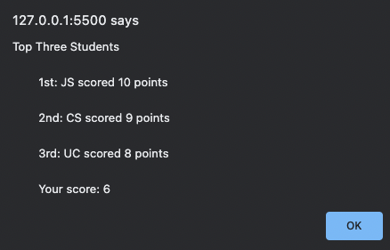

# Challenge Four: Javascript Quiz

## Project Description

Challenge four's requirement was to built a fully functioning quiz web application with Javascript's Web APIs. This application functions correctly if the user is given a timed quiz which saves their score afterwards. The user should then be able to compare their score with past high scores. The timed quiz on Javascript fundamentals informs the user whether their selected answer for each question is correct or not and subtracts 5 seconds to the timer for each missed question.

### Application Screenshot

The following images shows the quiz web application:

### Begin the Quiz

The following image shows the first question and its answer options. The start button is disabled and the timer has begun.

### Answer Check

The application informs the user whether their selected answer is correct or incorrect.

### Saving Your Score

After taking the quiz, the user will store their score and their intials into local storage.

### High Scores

After entering your initials and saving your score, you are able to view the top 3 scores from previous quiz attempts. 

### Link to Github Page
[https://jffsun.github.io/chall-four-quiz/](https://jffsun.github.io/chall-four-quiz/).

### Link to Github Respository
[https://github.com/jffsun/chall-four-quiz](https://github.com/jffsun/chall-four-quiz).